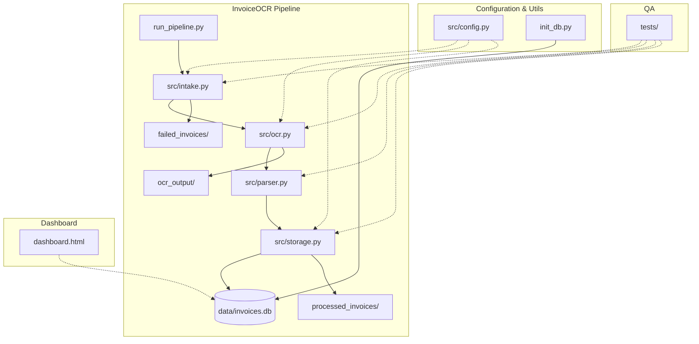

# Project Structure Diagram

```mermaid
graph TD
    subgraph Core ["InvoiceOCR Pipeline"]
        A[run_pipeline.py] --> B[src/intake.py]
        B --> C[src/ocr.py]
        C --> D[src/parser.py]
        D --> E[src/storage.py]
        E --> F[(data/invoices.db)]
        E --> G[processed_invoices/]
        B --> H[failed_invoices/]
        C --> I[ocr_output/]
    end

    subgraph Config ["Configuration & Utils"]
        J[src/config.py] -.-> B
        J -.-> C
        J -.-> E
        K[init_db.py] --> F
    end

    subgraph Testing ["QA"]
        L[tests/] -.-> B
        L -.-> C
        L -.-> D
        L -.-> E
    end

    subgraph UI ["Dashboard"]
        M[dashboard.html] -.-> F
    end
```